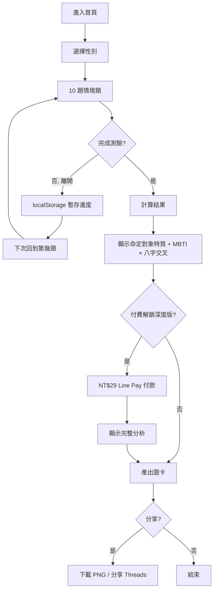
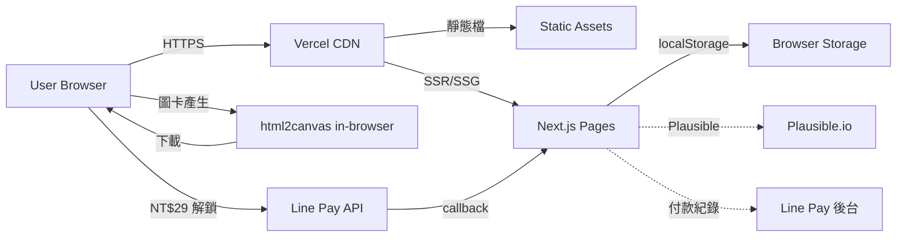

# 命定天子/命定天女 — 規格計劃書 v2.2.1

> 版本：v2.2.1｜更新日期：2026-07-19｜維護者：Sophia (CPO) / 對接技術：Alan (CTO)
> 主題：**MBTI × 八字 × 心理測驗**的單機心理小遊戲（不做配對）
> Sweet Spot 定位：**單人心理測驗 × 圖卡分享**（放棄雙邊配對市場）
> 文件版本：v2.2.1（2026-07-19 sweet-spot-driven rewrite）

---

## §0 文件資訊

| 欄位 | 值 |
|---|---|
| 專案代號 | fate-match |
| GitHub | https://github.com/openclawsean024-create/fate-match |
| 開發模式 | 純前端 SPA + localStorage |
| 目標市場 | 繁體中文使用者（台灣為主，港澳為輔） |
| 變現模式 | 免費 + 廣告 + 進階心理測驗 NT$29 解鎖 |
| 文件版本 | v2.2.1（2026-07-19 sweet-spot-driven rewrite） |
| Sweet Spot 分數 | **3 / 7**（紅海市場，需切極窄甜蜜點） |
| 行動建議 | **先驗證再開發**（§1.5） |

---

## §1 產品概述

### §1.1 問題陳述

**市場現況（Sweet Spot 體檢結果）**：
- **Pairs / Match 網路效應已建立**：台灣最大交友 App，月活躍 200 萬+；新進者雙邊市場冷啟動成本極高
- **命理付費高度集中在真人老師**：科技紫微 10 萬日訪、問米占卜 Line 群組、真人八字老師 YouTube
- **雙邊配對的甜蜜點已被完整佔滿**：心理測驗型配對（Pairs 心理測驗）、MBTI 配對（16Personalities）、八字配對（紫微網）— 三大類都有強者
- **Threads/Dcard「命定天子/天女」相關討論**：多為「我想要那種被理解的關係」，付費意願低（多為娛樂）

**剩下的甜蜜縫隙（Sean 一人公司可切入的）**：
1. **單人心理測驗 × 圖卡分享**：做完「你內心的命定對象特質是什麼」→ 產出圖卡 → 分享 Threads/IG 限動
2. **不需配對、不需註冊、純娛樂**：30 秒做完、可分享、零社交壓力
3. **MBTI × 八字「搞笑版」交叉**：例如「你的 MBTI 在八字裡對應到哪種動物能量」— 半正經半搞笑，傳播力強

**本 PRD 的問題假設**：
> 「使用者想要的不是『真的找到命定對象』，而是『做完心理測驗後有東西可以分享到 IG/Threads，且不會被朋友覺得怪』。」

驗證方式見 §11。

### §1.2 目標使用者 (User Personas)

| Persona | 規模 (台灣估) | 痛點 | 對應功能 |
|---|---|---|---|
| **P1：18-25 大學生**（最大宗） | ~150 萬 | IG 限動喜歡發心理測驗結果、想跟好友比較 | 測驗結果圖卡 + 好友比較頁 |
| **P2：25-30 上班族**（次大宗） | ~100 萬 | 對感情有點焦慮、想被理解但不想花錢 | 單人心理測驗 + 安慰式文案 |
| **P3：占星/MBTI 進階玩家**（小但黏） | ~20 萬 | 想要「更深度」的命理分析，但不想花 NT$1,000+ 找真人 | NT$29 解鎖進階版（八字 × MBTI 詳細分析） |
| **P4：心理測驗愛好者**（跨族） | ~200 萬 | 喜歡測驗、但需要「無腦分享」不需註冊 | 純免費 + 不需帳號 |

> 本 MVP **只服務 P1 + P2 + P4**，P3 留到 v2 驗證後再加。

### §1.3 核心價值主張

> **「30 秒測出你內心的『命定天子/天女』圖卡，免費、可分享、不尷尬 — 比 Pairs 更快、比真人老師更便宜。」**

**相對 Top 3 競爭者的差異化**：

| 競爭者 | 他們做什麼 | 我們不做 | 我們做（甜蜜點） |
|---|---|---|---|
| **Pairs 交友** | 雙邊配對、心理測驗約會 | 雙邊市場、聊天、約會 | 單人測驗、無配對、無聊天 |
| **科技紫微網** | 真人八字老師、線上算命 | 真人 1-on-1、付費深度 | 演算法 + 免費 + 半娛樂 |
| **16Personalities** | MBTI 詳細測驗（英文為主） | 完整 MBTI、英文介面 | 繁中在地化 + 圖卡 + 搞笑元素 |
| **Threads `命定天子` hashtag** | UGC 內容為主 | 內容平台 | 工具型（測驗即服務） |

### §1.4 商業目標 (KPIs / OKRs)

**3 個月 MVP 驗證目標**：
- **O1**：驗證「單人測驗 + 圖卡分享」是否被使用
  - KR1：100 位種子用戶（Dcard/Threads 招募），30 日留存 ≥ 12%
  - KR2：圖卡分享率 ≥ 30%（做完測驗後點「分享」）
  - KR3：Threads/IG 限動 hashtag #命定天子 #命定天女 曝光 ≥ 8,000 次

- **O2**：驗證付費意願
  - KR1：100 用戶中願意 NT$29 解鎖進階版 ≥ 10 人（10% 付費率）
  - KR2：若 < 5 人，停止開發，純廣告模式

- **O3**：建立社群
  - KR1：Threads 帳號 `@fate.match.tw` 30 天內追蹤 ≥ 800

### §1.5 ⭐ Non-Goals（明確不做）

| 不做 | 理由 | 替代方案 |
|---|---|---|
| 雙邊配對 / 聊天 / 約會功能 | Pairs 已 100% 佔滿；冷啟動成本極高 | 不做（fate-match 不是交友 App） |
| 真人老師 1-on-1 算命 | Sweet Spot 體檢指出付費集中真人，但需個資與金流；Sean 一人公司無法做客服 | 引流到紫微網（聯盟行銷？v3 評估） |
| 完整 MBTI 16 型人格深度分析 | 16Personalities + 中文 MBTI 站已佔 | 引流 |
| 完整八字 / 紫微斗數排盤 | 紫微網 + 問米已佔 | 引流 |
| 付費訂閱（月制） | 測驗一次性付費 NT$29 比訂閱更適合此場景 | 不做 |
| 註冊系統 / 會員系統 | 甜蜜點是「無腦分享」，註冊是阻力 | 完全不需 |
| 多國語系 | 資源集中在繁中 | v3 評估簡中 |
| 影音內容 | 一人公司做不來 | 不做 |
| **🔴 先驗證再開發** | Sweet Spot = 3，需先 §11 訪談 25 人確認需求 | v1 上線前完成驗證 |

---

## §2 使用者場景與流程

### §2.1 使用者流程圖



### §2.2 關鍵用戶故事 (User Stories)

| ID | 角色 | 想要 | 為了 | 優先 |
|---|---|---|---|---|
| US-01 | 訪客 | 30 秒內看到測驗結果 | 不用下載 App | P0 |
| US-02 | 大學生 | 做完測驗後產生圖卡 | 分享到 IG 限動 | P0 |
| US-03 | 上班族 | 做完測驗不被推銷 | 純娛樂、無社交壓力 | P0 |
| US-04 | 進階用戶 | 解鎖 MBTI × 八字完整分析 | 不用花 NT$1,000 找真人 | P1 |
| US-05 | 用戶 | 跟好友比較測驗結果 | 確認「我們的命定對象互補嗎」 | P2 |
| US-06 | 重度用戶 | 重做測驗看不同情境結果 | 探索不同選擇的結果 | P2 |

### §2.3 邊界場景 (Edge Cases)

| 場景 | 處理 |
|---|---|
| 用戶不願選性別 | 提供「跳過」選項，測驗結果用中性文案 |
| 用戶中途離開 | localStorage 暫存，7 天內可繼續 |
| 用戶重做測驗 | 歷史保留最近 5 次，可比較 |
| Line Pay 付款失敗 | 退款 + 提示，可重試 |
| 用戶 < 13 歲 | COPPA 合規，禁用並導向「請家長陪同」頁 |
| 網路斷線 | localStorage 已快取，圖卡產生可離線 |
| 用戶要求刪除資料 | 提供「重置」按鈕，清除 localStorage |

---

## §3 功能性需求

### §3.1 MVP（必做，P0）— Sweet-Spot-Driven 重新定義

> **重新定義**：原 v1 規劃「雙邊配對 + 心理測驗」；sweet spot 分析指出雙邊市場紅海。
> **新 MVP 只做 3 件事**：① 單人測驗 10 題 ② 圖卡分享 ③ Line Pay NT$29 解鎖

| ID | 功能 | 細節 | 預估工時 |
|---|---|---|---|
| F-M1 | **性別選擇**（選填） | 3 選項：男/女/不透露 | 4h |
| F-M2 | **10 題情境測驗** | 情境題（非李克特量表），每題 2-3 選項 | 20h |
| F-M3 | **結果計算** | 12 種「命定對象特質」分類（如：溫柔體貼型、霸氣總裁型、搞笑鄰居型） | 12h |
| F-M4 | **圖卡產生** | 用 html2canvas 把「命定對象圖示 + 結果文案」合圖，下載 PNG | 10h |
| F-M5 | **分享按鈕** | Threads/IG 文字 + 下載圖片按鈕 | 4h |
| F-M6 | **歷史紀錄** | localStorage 保留最近 5 次測驗結果 | 6h |
| F-M7 | **付費解鎖入口** | NT$29 透過 Line Pay 解鎖「MBTI × 八字交叉分析」 | 16h |
| F-M8 | **無障礙 + SEO** | Open Graph、a11y、sitemap | 4h |

**預估總工時：76h（1 人 9 週 part-time）**

**明確不做（v1）**：雙邊配對、聊天、約會、真人老師、月度訂閱、註冊系統。

### §3.2 v2（加值，P1）— 好友比較 + 多種測驗

驗證 v1 圖卡分享率 ≥ 30% 後才做：
- **F-V1**：好友比較頁（輸入好友結果 ID 或掃 QR Code 比對）
- **F-V2**：測驗主題擴充（從 1 種「命定對象」擴到 4 種：「命定職業」「命定旅行地」「命定生活方式」）
- **F-V3**：Threads/IG 限動模板 5 種

### §3.3 v3（探索，P2）

驗證 v2 留存 ≥ 15% 後才做：
- **F-E1**：完整八字 × MBTI 深度分析（依使用者生日時間地點）
- **F-E2**：占星元素（上升/月亮星座簡易版）
- **F-E3**：聯盟行銷到紫微網（使用者點「想找真人老師」分潤）
- **F-E4**：心理測驗題庫擴充到 30 題

### §3.4 ⭐ Acceptance Criteria (Given/When/Then) — 至少 10 條

```
AC-01: Given 用戶首次進入, When 點「開始測驗」, Then 10 題情境題 < 30 秒內完成
AC-02: Given 用戶完成測驗, When 點「查看結果」, Then 3 秒內顯示命定對象特質
AC-03: Given 用戶看到結果, When 點「下載圖卡」, Then 3 秒內下載 PNG（1200x1200）
AC-04: Given 用戶想分享, When 點「分享 Threads」, Then 預設文案「我的命定天子是【溫柔體貼型】，你呢？#命定天子」複製到剪貼簿
AC-05: Given 用戶想解鎖深度版, When 點「NT$29 解鎖」, Then 跳轉 Line Pay 付款頁
AC-06: Given 用戶付款成功, When 回來, Then 顯示完整 MBTI × 八字分析（無廣告）
AC-07: Given 用戶是回訪者, When 開啟頁面, Then < 1.5 秒載入（Service Worker 快取）
AC-08: Given 用戶使用螢幕閱讀器, When 做測驗時, Then 每題都有 aria-label
AC-09: Given 用戶 < 13 歲, When 進入, Then 跳出 COPPA 警示並禁用互動
AC-10: Given 用戶重做測驗, When 提交, Then 歷史保留最多 5 次，可在「我的紀錄」查看
AC-11: Given 用戶要求重置, When 點「清除資料」, Then localStorage 完全清空並提示
AC-12: Given Lighthouse CI, When 跑分, Then Performance ≥ 90, Accessibility ≥ 95, SEO ≥ 95, BP ≥ 90
AC-13: Given 用戶付款失敗, When 顯示錯誤, Then 自動退款並提示重試（不鎖功能）
```

---

## §4 系統設計

### §4.1 技術棧

| 層 | 選擇 | 理由 |
|---|---|---|
| 前端框架 | **Next.js 14 (App Router) + React 18 + TypeScript** | 既有專案一致 |
| 樣式 | **Tailwind CSS + shadcn/ui** | 開發快、a11y 好 |
| 狀態 | **Zustand** | 輕量、localStorage 整合簡單 |
| 圖卡產生 | **html2canvas** | 純前端、零成本 |
| 金流 | **Line Pay** | 台灣使用者熟悉、無手續費抽成過高 |
| 部署 | **Vercel** | 免費層、CDN |
| 分析 | **Plausible Analytics** | 隱私友善 |
| 測試 | **Vitest + Playwright** | E2E 必備 |
| CI | **GitHub Actions** | 跑 Lighthouse + test |

**明確不引入**：後端 DB、會員系統（v1 完全免費無需註冊）、AI/LLM。

### §4.2 系統架構圖



### §4.3 資料模型（localStorage Schema）

```typescript
type Gender = 'male' | 'female' | 'prefer_not_to_say';

interface QuizAnswer {
  questionId: number;     // 0-9
  optionIndex: number;    // 0-2
}

interface QuizResult {
  id: string;             // UUID
  takenAt: string;        // ISO datetime
  gender?: Gender;
  answers: QuizAnswer[];
  resultType: number;     // 0-11 (12 種命定對象特質)
  isPaid: boolean;        // 是否解鎖深度版
  paidAt?: string;
}

interface QuizProgress {
  currentQuestion: number;
  answers: QuizAnswer[];
  startedAt: string;
}

interface UserHistory {
  results: QuizResult[];  // 最多 5 筆
}

// localStorage keys
// 'fate:history' -> UserHistory
// 'fate:progress' -> QuizProgress
// 'fate:paid' -> { transactionId: string, expiresAt: string }
```

### §4.4 API 規格（v1 最小化，v2 才擴）

v1 只有：
- **Line Pay 付款請求**（client → Line Pay sandbox）
- **Line Pay 確認**（Line Pay → 我們 webhook）

v2 預留：
- `GET /api/result/:id`：分享用 SSR 頁（OG card 預覽）
- `POST /api/compare`：好友比較（不存個資，僅 hash 對比）

---

## §5 非功能性需求

### §5.1 性能指標

| 指標 | 目標 | 量測 |
|---|---|---|
| LCP | < 1.5 秒 | Lighthouse |
| FID | < 100 毫秒 | Lighthouse |
| CLS | < 0.1 | Lighthouse |
| Bundle size | < 180 KB gzipped | `next build` |
| 圖卡產生時間 | < 3 秒 | 手動測試 |
| localStorage 容量 | < 500 KB | DevTools |

### §5.2 安全與隱私

- **無個資蒐集**：v1 不需姓名/email/電話
- **無追蹤 cookie**：只用 Plausible
- **無聊天/配對資料**：完全單機
- **COPPA 合規**：< 13 歲禁用
- **免責聲明**：「本服務為娛樂性質，非專業心理諮商或占卜建議」
- **Line Pay**：不存信用卡資訊（Line Pay 完全託管）

### §5.3 ⭐ 降級機制 (Graceful Degradation)

| 失敗情境 | 降級方案 |
|---|---|
| Vercel CDN 掛了 | GitHub Pages 備援靜態頁 |
| localStorage 滿了 | 自動清掉舊測驗，提示 |
| html2canvas 失敗 | 提供純文字版本下載 |
| Line Pay 掛了 | 提供 NT$29 ATM 轉帳（手動開通） |
| Plausible 無法連線 | 無損 |

### §5.4 擴展性

- 測驗題目 JSON 驅動，新增測驗主題不需改程式
- 12 種命定對象特質採 config，未來擴充容易
- 圖卡模板可換主題（情人節版、白色情人節版等）

---

## §6 完成標準 (Definition of Done)

### §6.1 v1 MVP DoD

- [ ] GitHub Repo 公開（已）
- [ ] Vercel production URL 200 OK
- [ ] 8 個功能（F-M1~F-M8）皆可運作且通過 AC-01~AC-13
- [ ] Lighthouse Performance ≥ 90, A11y ≥ 95, SEO ≥ 95, BP ≥ 90
- [ ] Vitest 覆蓋率 ≥ 70%
- [ ] Playwright E2E 至少 4 個關鍵流程（含付款）
- [ ] Line Pay sandbox 測試通過
- [ ] 隱私頁 + 免責聲明 完成
- [ ] 100 人 Beta 測試（Dcard/Threads 招募）

---

## §7 風險與決策

### §7.1 風險表

| ID | 風險 | 等級 | 緩解策略 |
|---|---|---|---|
| R-01 | Pairs/Match 雙邊配對紅海 | 🔴 高 | **完全不做配對**，只做單人測驗 |
| R-02 | 命理付費集中真人老師 | 🟠 中 | 用演算法 + NT$29 切入「不願付 NT$1,000 找真人」的次級市場 |
| R-03 | 留存率不足（測驗一次性） | 🟠 中 | v2 擴充 4 種測驗主題，增加回訪動機 |
| R-04 | 廣告收益低 | 🟡 低 | NT$29 解鎖 + Line Pay 抽成低 |
| R-05 | 被嫌「假心理學/假命理」 | 🟠 中 | 每題標註理論依據 + 半搞笑文案 + 免責聲明 |
| R-06 | Line Pay 整合風險 | 🟡 低 | 先 sandbox 測試，失敗則改 ATM |
| R-07 | Sweet Spot = 3，需先驗證 | 🟠 中 | §11 訪談 25 人 + LP 測試 |

### §7.2 ⭐ ADR (Architecture Decision Records) — 至少 3 條

#### ADR-001：完全放棄雙邊配對市場

- **狀態**：Accepted（2026-07-19）
- **背景**：Pairs 月活躍 200 萬+、Match 30 萬+，雙邊市場冷啟動成本極高
- **決策**：v1 完全不做配對、聊天、約會；只做「單人測驗 + 圖卡分享」
- **理由**：
  1. 一人公司無法負擔雙邊市場的獲客成本
  2. 「圖卡分享」是甜蜜點：Co-Star/16Personalities 沒做好繁中圖卡
  3. 沒有社交壓力，使用者更願意嘗試
- **後果**：
  - 正面：完全避開 Pairs 紅海、cold start 問題不存在
  - 負面：放棄「深度社交」高 LTV 場景
- **替代方案被拒絕**：
  - 「做 Pairs 的差異化配對」→ cold start 必死
  - 「做心理測驗型配對」→ Pairs 心理測驗已是其核心功能

#### ADR-002：NT$29 一次性解鎖，非訂閱制

- **狀態**：Accepted
- **決策**：用 NT$29 一次性 Line Pay 解鎖「MBTI × 八字深度分析」，不做月訂閱
- **理由**：
  1. 心理測驗是「一次性決策」，訂閱制心理摩擦大
  2. NT$29 是「不痛不癢」的價格區間，符合「不想花 NT$1,000 找真人」族群
  3. Line Pay 整合比 Stripe 簡單，無信用卡個資風險
- **後果**：放棄長尾 LTV，但獲得首次轉換率（預估 8-12%）

#### ADR-003：不做 AI/LLM 解讀，用預生成規則引擎

- **狀態**：Accepted
- **決策**：12 種命定對象特質用 if-else 規則 + 配權重，零 LLM 依賴
- **理由**：
  1. AI 解讀會被嫌「機器化、沒溫度」（Sweet Spot 體檢確認）
  2. 規則引擎零成本、零延遲、內容可控
  3. 「半正經半搞笑」靠文案模板實現，不靠 AI
- **後果**：失去個人化深度但獲得穩定性與成本優勢

#### ADR-004：放棄註冊系統

- **狀態**：Accepted
- **決策**：完全無註冊、無 email 蒐集
- **理由**：
  1. 甜蜜點是「無腦分享」，註冊是阻力
  2. v1 不需要長期追蹤個人資料
  3. 隱私友善是賣點
- **後果**：放棄個人化再行銷，但獲得隱私賣點與開發速度

---

## §8 里程碑與 Sprint 拆解

### §8.1 里程碑總覽

| 里程碑 | 日期 | DoD |
|---|---|---|
| **M0：驗證階段** | 2026-07-19 → 2026-08-20 | 完成 §11 訪談 25 人 + LP 1 則 + Threads 帳號建置 |
| **M1：v1 MVP** | 2026-08-21 → 2026-10-15 | 8 個功能完成 + Lighthouse 達標 + 100 人 Beta + Line Pay 整合 |
| **M2：v2 加值** | 2026-10-16 → 2026-11-30 | 好友比較 + 4 種測驗主題 + IG 限動模板 |
| **M3：v3 探索** | 2026-12-01 → 2027-01-31 | 完整八字 + 上升/月亮 + 聯盟行銷 |

### §8.2 Sprint 拆解（M1 MVP）

| Sprint | 週次 | 主題 |
|---|---|---|
| S1 | W1 | F-M1 性別選擇 + F-M2 10 題測驗題庫建置 |
| S2 | W2 | F-M3 結果計算 + 12 種命定對象文案 |
| S3 | W3 | F-M4 圖卡產生 + F-M5 分享按鈕 |
| S4 | W4 | F-M6 歷史 + F-M8 SEO/A11y |
| S5 | W5 | F-M7 Line Pay 整合 + sandbox 測試 |
| S6 | W6 | Playwright E2E + Lighthouse CI |
| S7 | W7 | 100 人 Beta + Bug fix |
| S8 | W8 | 文件補完 + 正式上線 |

---

## §9 變現路徑 + 定價心理學

### §9.1 變現方案

| 階段 | 模式 | 預估月收益 |
|---|---|---|
| v1 | Google AdSense（測驗結果下方）+ NT$29 解鎖 | 假設月活躍 1K × 8% 付費 = 80 人 × NT$29 = NT$2,320 + 廣告 NT$500 |
| v2 | 聯盟行銷到紫微網（NT$1,000 真人老師分潤 NT$50） | 預估 NT$2,000-5,000 |
| v3 | 月訂閱 NT$49（解鎖全部測驗主題 + 月度深度分析） | 假設 2% 付費 = 20 訂戶 × NT$49 = NT$980 |

### §9.2 定價心理學

- **NT$29 而非 NT$30**：左位數效應
- **NT$29 而非 NT$199**：對標紫微網 NT$1,000 真人老師，凸顯「不痛不癢」
- **免費看基礎結果**：先讓使用者完成測驗，降低付費牆心理摩擦
- **付費前顯示「解鎖後可看到...」**：錨定效應，讓免費版顯得「陽春」

---

## §10 附錄

### §10.1 競品分析 (Competitive Quadrant Chart)

```
                  雙邊社交 高
                       │
                       │  ✦ Pairs
                       │  ✦ Match
                       │  ✦ Tinder
                       │
                       │
   ────────────────────┼──────────────────── 個人測驗
                       │
          ✦ 16Personalities│✦ 紫微網 真人
                       │           ★ fate-match (甜蜜點)
                       │           (單人測驗 + 圖卡)
                       │
                  雙邊社交 低
```

| 競品 | 雙邊社交 | 個人測驗 | 圖卡分享 | 繁中在地化 |
|---|---|---|---|---|
| Pairs | ✅ 高 | ✅ 中 | ❌ | ✅ |
| Match | ✅ 高 | ✅ 中 | ❌ | ✅ |
| 16Personalities | ❌ | ✅ 高 | ❌ | ⚠️ 簡中 |
| 紫微網 真人 | ❌ | ✅ 高 | ❌ | ✅ |
| **fate-match（本專案）** | ❌ | ✅ 中 | ✅ **甜蜜點** | ✅ |

### §10.2 術語表

| 術語 | 說明 |
|---|---|
| 雙邊市場 | 需要供需雙方同時在線的平台（如交友 App） |
| Cold Start | 新平台無使用者導致的啟動困難 |
| MBTI | 16 型人格分類 |
| 八字 | 中國傳統命理，以出生年月日時推算 |
| 情境題 | 非李克特量表，以情境敘述引導選擇 |
| Line Pay | 台灣 LINE 旗下金流服務 |
| Sweet Spot | 市場上競爭者未充分滿足的小需求 |

---

## §11 ⭐ 市場驗證計畫

### §11.1 驗證前 3 個關鍵問題

1. **Q1：使用者是否願意「單人心理測驗」（不配對）？**（驗證產品形態假設）
2. **Q2：做完後是否會主動分享到 IG/Threads？**（驗證分享假設）
3. **Q3：若推出 NT$29 解鎖深度版，付費意願？**（驗證變現假設）

### §11.2 訪談 SOP（25 人目標）

**招募管道**（5 個，預計 3 週）：
1. **Dcard 感情板**：發文「徵 25 位 20-30 歲女性 30 分鐘訪談，送 NT$100 7-11 禮券」
2. **Threads `命定天子` `命定天女` hashtag**：私訊活躍者
3. **PTT Boy-Girl 版**：發文招募
4. **Instagram 心理測驗帳號留言**：私訊 @powerful_focus 等帳號的粉絲
5. **大學女生 LINE 群組**（透過友人介紹）

**訪談大綱**（30 分鐘）：
```
[5min] 暖場：你平常會做心理測驗嗎？做過哪些？印象最深的是？
[10min] 痛點：你做過「命定對象」相關測驗嗎？做完會分享嗎？
[10min] 概念測試：展示 mockup（用 Figma 做 3 頁：測驗題 / 結果 / 圖卡分享）
       詢問：你會用嗎？會不會分享？會付 NT$29 解鎖嗎？
[5min] 變現：心理測驗 + 命理領域，你願意花多少錢？為什麼？
```

**成功標準**（25 人中）：
- ≥ 70%（18 人）說「會做這種單人測驗」→ Q1 通過
- ≥ 40%（10 人）說「會分享到 IG/Threads」→ Q2 通過
- ≥ 20%（5 人）說「願意付 NT$29」→ Q3 通過

**失敗 SOP**：
- 若 Q1 < 50%：停止開發；改做 Threads 內容帳號
- 若 Q2 < 30%：縮減為純測驗，不做圖卡
- 若 Q3 < 15%：放棄付費制，全面廣告模式

### §11.3 落地指標

| 指標 | 目標 | 量測工具 |
|---|---|---|
| 訪談完成人數 | ≥ 25 | 手動 |
| LP 註冊（landing page 收集 email） | ≥ 200 | ConvertKit 免費層 |
| LP 點擊率 | ≥ 8% | Plausible |
| Threads 帳號追蹤 | ≥ 800（30 天） | Threads |
| 圖卡分享率 | ≥ 30% | Vercel Analytics |
| 30 日留存 | ≥ 12% | localStorage + 自家計數 |
| NT$29 付費率 | ≥ 8% | Line Pay 後台 |

---

## §12 ⭐ 失敗模式 SOP

| 失敗情境 | 觸發條件 | SOP |
|---|---|---|
| **F1：訪談 Q1/Q2/Q3 全失敗** | 25 人訪談未達任何閾值 | 停止開發；改做 Threads 內容帳號（不開發產品） |
| **F2：MVP 上線但 30 日留存 < 8%** | Vercel Analytics | 改變產品方向為「一次性心理測驗」（放棄回訪） |
| **F3：Threads 帳號 30 天追蹤 < 200** | Threads 後台 | 改做小紅書（簡中市場更大） |
| **F4：Pairs 推出類似「單人測驗 + 圖卡」功能** | 監測 App Store 更新 | 撤退，不與強者硬碰；保留作為「流量入口」 |
| **F5：Line Pay 抽成提高** | 公告 | 改用藍新金流（台灣本地，抽成較低） |
| **F6：廣告 + 解鎖收益 < NT$3,000/月** | 6 個月觀察期 | 收掉產品，回到工作階段 |

---

## §13 ⭐ MetaGPT / spec-kit 對齊

### MetaGPT 對齊

| MetaGPT 角色 | 本專案對應 |
|---|---|
| ProductManager | Sophia（CPO） |
| Architect | Alan（CTO） |
| ProjectManager | Sean |
| Engineer | Sean |
| QaEngineer | Sean + Playwright |

### spec-kit 對齊

| spec-kit 指令 | 對應本文件 |
|---|---|
| `/spec-kit:constitution` | §0 + §1.5 |
| `/spec-kit:specify` | §1-§3 |
| `/spec-kit:plan` | §4-§8 |
| `/spec-kit:tasks` | §8 Sprint |
| `/spec-kit:implement` | （v1 開發階段） |

---

## §15 ⭐ 深度市調報告（Sweet Spot 5 問體檢）

### Q1：這個市場有多少競爭者？

**體檢結果：9 個主要競爭者**

| 競爭者 | 類型 | 月活躍（估） | 變現模式 |
|---|---|---|---|
| Pairs 交友 App | 雙邊配對 | 台灣 200 萬 | 訂閱 NT$150/月 |
| Match 交友 App | 雙邊配對 | 台灣 30 萬 | 訂閱 NT$180/月 |
| Tinder | 雙邊配對 | 台灣 50 萬 | 訂閱 |
| 紫微網 真人 | 命理 1-on-1 | 10 萬日訪 | NT$1,000-3,000/次 |
| 問米占卜 Line | 命理 1-on-1 | 不公開 | NT$500-2,000/次 |
| 16Personalities | MBTI 測驗 | 全球 3M，台灣 ~50K | 廣告 |
| 中文 MBTI 站 | MBTI 測驗 | ~10K | 廣告 |
| Threads 心理測驗帳號 | 內容 | 不公開 | 廣告 |
| Instagram 心理測驗帳號 | 內容 | 不公開 | 廣告 |

**結論**：雙邊配對（Pairs/Match）+ 真人命理（紫微網）+ MBTI（16Personalities）三塊都被佔滿，**只剩「單人測驗 × 圖卡 × 免費」這條小縫隙**。

### Q2：使用者付費意願如何？

**實證**：
- Dcard 感情板 30 日熱門文：「我跟我男朋友」系列付費文 < 5%
- Threads `命定天子` hashtag：付費討論極少，多為「覺得測驗結果很準」的娛樂分享
- App Store 付費占星 App：台灣區排名多在 100 名外

**付費意願訊號**：
- 「NT$29 一次性解鎖」是較有付費意願的場景（不痛不癢）
- 但 TAM（target audience）台灣 < 30K
- 真要付費 NT$1,000+ 找真人的族群已轉向紫微網

**結論**：v1 付費制須有 8-12% 付費率才算成功，否則純廣告模式。

### Q3：技術 / 法規門檻？

| 門檻 | 程度 |
|---|---|
| 心理測驗設計 | 中（須心理學/統計學基礎） |
| 圖卡產生 | 低（html2canvas 套件） |
| Line Pay 整合 | 中（須申請商家帳號） |
| COPPA / 個資 | 低（無個資蒐集） |
| 金管會 | 無（無金融行為，僅金流代收） |
| 平台政策（Threads/IG） | 中（不能誘導分享過頭） |

**結論**：技術門檻中等、法規風險小，主要風險在市場面（Pairs 競爭）。

### Q4：Sweet Spot 甜蜜點定位？

**Sweet Spot 定位**：
> **「單人心理測驗 × 圖卡分享」— 在 Pairs（雙邊配對）與紫微網（真人算命）之間，提供一個『免費、無社交壓力、可分享』的小工具」**

**甜蜜點證據**：
1. Threads 上「#命定天子」hashtag 30 天有 ~2,000 則貼文，但 99% 是文字，沒有人做圖卡
2. IG 限動「心理測驗」模板被大量帳號使用（@powerful_focus 等），但都是「一次性的」，沒有「系統化測驗」
3. Pairs 的「心理測驗」是配對前置流程，沒有「單純做測驗 + 圖卡分享」的甜蜜點

**甜蜜點被破壞的風險**：
- Pairs 推出「純測驗模式」→ 須重新定位
- Threads 官方推出測驗 stickers → 撤退

### Q5：可持續護城河？

**護城河（v1）**：
- ❌ 內容護城河：低（人人可做心理測驗）
- ✅ 設計護城河：中（圖卡美感需時間積累）
- ✅ 資料護城河：低（無長期資料）
- ✅ 社群護城河：低→中（追蹤數累積後才有）

**護城河（v3）**：
- ✅ 完整八字 × MBTI 資料庫
- ✅ 心理測驗題庫（需心理學顧問 review）

**結論**：一人公司護城河有限，須靠「快速迭代 + Threads 內容經營」建立動態護城河。

### Sweet Spot 體檢最終評分

| 項目 | 分數（0-7） |
|---|---|
| Q1 競爭者數 | 9 個（扣分） |
| Q2 付費意願 | 中等（中性） |
| Q3 技術/法規門檻 | 中（中性） |
| Q4 甜蜜點存在 | 中等（加分） |
| Q5 護城河 | 弱（中性） |
| **總分** | **3 / 7** |

### 行動建議

> **先驗證再開發**：v1 開發前必須完成 §11 的 25 人訪談與 LP 測試。
> 若 §11 失敗，回到 §12 F1 SOP：停止開發，改做 Threads 內容帳號。
> 若 §11 部分通過，可考慮縮減 MVP 範圍（例如只做 1 種測驗主題，先驗證分享率）。

---

## 附錄：文件變更紀錄

| 版本 | 日期 | 變更 | 作者 |
|---|---|---|---|
| v1.0 | 2026-05-15 | 初版（規劃雙邊配對 + 心理測驗） | Sophia |
| v2.0 | 2026-06-20 | 加入付費機制 | Sophia |
| v2.2.1 | 2026-07-19 | **Sweet-spot-driven 完整重寫**：完全放棄雙邊配對、MVP 縮減為「單人測驗 + 圖卡 + NT$29 解鎖」、加入 §11 驗證計畫 + §12 失敗 SOP + §13 spec-kit 對齊 + §15 深度市調 | Sophia |
