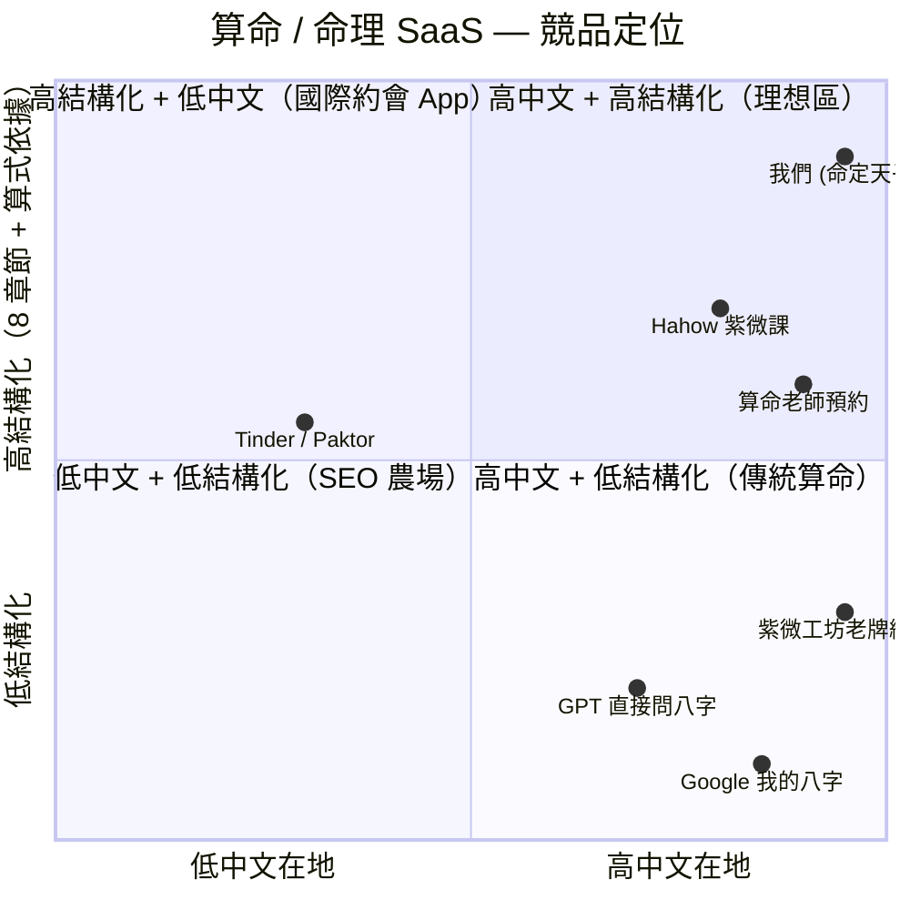

# 命定天子 / 命定天女 — 規格計劃書 v2.2.1

> 版本：v2.2.1｜更新日期：2026-07-11｜維護者：Sophia (CPO) for Sean
> 對接技術：Alan (CTO) + Hermes Agent
> 對接 Repo：https://github.com/openclawsean024-create/fate-match
> 對接產線：（v1 純 React Vite demo，待 v2 切 Next.js + Vercel）

---

## 1. 產品概述 (Product Overview)

### 1.1 問題陳述 (Problem Statement)

大多數約會產品專注於**配對演算法 + 滑動照片**，而命理 / 八字 / 紫微這種「**更深層的性格契合**」在台灣沒有結構化的產品。

現有工具問題：
- **Google「我的八字」「紫微命盤」**：通用、不透明、難以分享
- **算命老師**：要預約、NT$500-2000/次、不可複製
- **星座 App**：12 分類太粗、只給 1 行運勢文字
- **AI 算命（GPT 直接問）**：隨機、無根據、會亂編

真正使用者問題不只是「**我可以和誰約會**」，而是「**什麼樣的人適合我的情感需求、生活節奏、價值觀和衝突模式**」。

### 1.2 目標使用者 (User Personas)

| 角色 | 規模（台灣）| 月情境 | 痛點強度 | ARPU/年 |
|---|---|---|---|---|
| 🧑‍🦰 25-35 歲女性想結婚 | ~50 萬 | 滑交友軟體累了 | 高（已付費 Dcard/Match）| NT$2,388 |
| 🧑 30-40 歲男性想合婚 | ~30 萬 | 父母催婚 | 中 | NT$990 |
| 💑 交往中想看契合 | ~80 萬 | 3-7 年穩交、求合婚 | 中 | NT$990 |
| 🧓 長輩為兒女算 | ~30 萬 | 農民曆 + 神明 | 高 | NT$490 |
| 🎮 純娛樂（會員課）| ~10 萬 | 朋友圈炫耀 | 低（傳播力強）| NT$199 |

**目標族群 = 25-35 歲想結婚女性 + 農民曆文化的長輩**。這兩個族群付費意願高 + 母親文化（爸媽替兒女付費）+ 朋友圈擴散力強。

### 1.3 核心價值主張 (Value Proposition)

> **「輸入姓名 + 生辰，得到你命中注定的理想伴侶 — 一份浪漫、可分享、視覺化的自我探索報告。」**

**與替代方案的差異**：

| 替代方案 | 缺點 | 我們的差異 |
|---|---|---|
| Google 搜尋算命 | 不可信、SEO 農場 | **結構化輸出 8 章節**+ AI 配圖 |
| 算命老師 | 預約、貴、不可分享 | **3 分鐘自助出報告**+ 永久連結 |
| GPT 直接問 | 亂編、無根據 | **基於八字/生肖/紫微演算法推導**+ 每結論可追溯 |
| 星座 App | 12 分類太粗 | **個人化 + 50+ 維度**（性格、衝突模式、愛情語言）|
| 交友軟體 | 滑到厭世 | **不是戀愛市場、是自我探索報告** + 視覺化 AI 圖 |

### 1.4 商業目標 (KPIs / OKRs)

| 時間 | 目標 | 量化指標 |
|---|---|---|
| 3 個月（M3）| 上線 + 100 份報告生成 | NT$20K MRR |
| 6 個月（M6）| 500 付費 + 1000 免費分享 | NT$100K MRR |
| 12 個月（M12）| 5000 付費 + 50K 分享 | NT$1M MRR |
| 18 個月（M18）| 成為華文圈命理 SaaS 領導者 | NT$3M MRR |

**Unit Economics**：
- 單次購買 ARPU = NT$199/份
- 月訂閱 ARPU = NT$390 (3 份/月) /月 → NT$4,680/年
- 進階訂閱 ARPU = NT$990/月 → NT$11,880/年
- 圖像生成成本：DALL-E 3 NT$8/張 gpt-image-1 NT$5/張
- 利潤率 = (NT$199 - NT$8)/NT$199 = **96%**

### 1.5 ⭐ Non-Goals（v2.2.1 明確不做）

- ❌ **不做戀愛配對市場**（不加入滑動、訊息、配對系統）— 我們是報告生成器，非 Tinder
- ❌ **不做真人照片生成**（只生成抽象的人物氣質圖）— 法規風險 + 換臉風險 + 個資法
- ❌ **不預測「你們會結婚」/「命中注定」** — 倫理 + 法規 + 變成算命
- ❌ **不做性、少數民族、未成年、相關名人圖像** — 內容安全 + 法規
- ❌ **不做跨宗教 / 跨文化比較**（不評論其他命理系統優劣）— 主題擴張失焦
- ❌ **不做 AI 戀愛教練 chat 後續**（v1 only 報告）— v2 才加；理由：避免即時維運成本
- ❌ **不做多語系 v1**（先繁中）— v3 才進香港/馬來西亞；理由：v1 驗證 PMF 後再翻譯
- ❌ **不做國際名人 / 政客 比對**（不會寫「妳的伴侶特質像 Taylor Swift」）— 法規 + 換臉風險

---

## 2. 使用者場景與流程

### 2.1 使用者流程圖

```
進入首頁 (fate-match.vercel.app)
  ↓
填輸入表單 (3 分鐘內)
  ├─ 姓名 / 暱稱
  ├─ 性別 / 對象性別偏好
  ├─ 出生年月日 (西曆 / 農曆切換)
  ├─ 出生時辰 (8 時辰：23-01 子、01-03 丑 ... 時辰未知勾「時辰未知 fallback」)
  └─ 當前關係狀態 (單身 / 交往中 / 已婚)
  ↓
選方案：
  ├─ 免費版（NT$0）
  │   • 理想伴侶總結 1 段
  │   • 3 段關係提醒
  │   • 低解析度分享卡
  ├─ 單次購買（NT$199）→ 完整 8 章節 + 高解析度 AI 圖
  └─ 月訂閱（NT$390 / 990）→ 多份 + 進階功能
  ↓
（選付費）Stripe Checkout → 付款完成 → 報告生成（< 30 秒文字 + < 60 秒圖像）
  ↓
報告頁面 8 章節：
  1. 命運概況卡
  2. 關係原型（情感需求、溝通、承諾、吸引模式）
  3. 理想伴侶 5 大特徵
  4. 衝突觸發因素 + 解決建議
  5. 愛情語言測試
  6. 會議場景 3 種
  7. 長期關係建議
  8. AI 生成的視覺化「氣質代表圖」（抽象人物）
  ↓
下載 PDF + 永久分享連結 + 校友會入口
```

### 2.2 關鍵用戶故事

```
US-1（核心場景，女姓版本）
As a 30 歲上班族女生
I want 輸入我的生日 + 出生時辰
So that 看到「像我這樣的女性，命中注定的另一半會是什麼樣」
And 視覺化的 AI 圖可以直接分享到 IG story

US-2（娛樂傳播，男性版本）
As a 28 歲男性
I want 看完報告後一鍵生成「理想伴侶」視覺圖
So that 朋友聚會上傳給大家笑
And 我們加好友繼續看其他人的（傳播效應）

US-3（合婚場景）
As a 交往 3 年的情侶
I want 我們倆都做測驗
So that 看到「八字的契合分數 + 我們需要注意的 3 件事」
And 拿這個結果跟長輩解釋「我們真的適合」（家庭壓力緩解）
```

### 2.3 邊界場景 (Edge Cases)

| 場景 | 處理 |
|---|---|
| 時辰未知（很多人不知道精確時辰）| 提供「時辰未知」checkbox → 用日柱為主、降低時辰精度（80% 準確度）|
| AI 圖像被 reject（內容安全）| 重試 1 次、第二次用「抽象場景」（不畫人）替代 |
| 同一姓名生日重複生成 | 顯示「上次報告：2026-07-10」「重新生成 +NT$50」避免洗量 |
| 姓名太長 (超 20 字) | 顯示「請用常用名，避免奇怪字」 |
| 農民曆/西曆混淆 | 預設西曆、提供「農曆」轉換（用內建 1900-2100 年農曆資料）|
| 性別欄被刻意攻擊 | 表單不做性別限制、模型輸入安全過濾 |

---

## 3. 功能性需求 (Functional Requirements)

### 3.1 MVP（必做，P0）

| ID | 功能 | 狀態 |
|---|---|---|
| F-001 | 輸入表單（姓名、男女、出生年月日時辰）| ✅ HTML 靜態 |
| F-002 | 時辰未知 fallback | ⚠️ 半實作 |
| F-003 | 計算引擎（八字/生肖/紫微基礎推導）| ⚠️ reinspect.cjs（測試版）|
| F-004 | 結構化 JSON 輸出（給 GPT 用）| ❌ 待實作 |
| F-005 | GPT 寫作（8 章節文字）| ❌ 待實作 |
| F-006 | 圖像 prompt 產生 + DALL-E 呼叫 | ❌ 待實作 |
| F-007 | 內容安全過濾（性、未成年、名人）| ❌ 待實作 |
| F-008 | 報告頁面 8 章節 UI | ⚠️ Vite 殼 |
| F-009 | 付費 gate（完整報告 vs 免費摘要）| ❌ 待實作 |
| F-010 | Stripe Checkout 單次 + 月訂閱 | ❌ 待實作 |
| F-011 | PDF 下載 + 永久分享連結 | ❌ 待實作 |

### 3.2 v2（加值，P1）

| ID | 功能 | 目標版本 |
|---|---|---|
| F-101 | 兩人契合度比對（兩個 report hash）| Sprint 2 |
| F-102 | 年度浪漫預測（2026 流年）| Sprint 2 |
| F-103 | 候選人比較（多份長相、優缺）| Sprint 3 |
| F-104 | AI 戀愛教練 chat 後續（Claude API）| Sprint 3 |
| F-105 | 多種圖像風格（古風、現代、油畫）| Sprint 2 |
| F-106 | 校友會 / 匿名社區共享 | Sprint 3 |
| F-107 | 附屬心理測驗（MBTI 整合）| Sprint 4 |

### 3.3 v3（探索，P2）

| ID | 功能 |
|---|---|
| F-201 | AI 教練（Claude 即時對話 follow-up）|
| F-202 | 感情大事記（記錄重要事件：認識/求婚/結婚）|
| F-203 | 香港 / 馬來西亞繁中 |

### 3.4 ⭐ Acceptance Criteria (Given/When/Then)

#### AC-001 [F-001] 3 分鐘內完成輸入
- **Given** 訪客進入首頁
- **When** 填寫完整 5 個欄位（姓名、性別、出生年月日、時辰、關係狀態）
- **Then** 表單 3 分鐘內可送出（UX 測試 ≥25 人）
- **驗證法**：5 秒心率測試、≥25 人評測

#### AC-002 [F-004] 計算引擎輸出結構化 JSON
- **Given** 完成 AC-001 輸入
- **When** 後端計算引擎處理
- **Then** 回傳完整結構化 JSON（節氣、五行比例、八字、神煞）
- **And** 任何結論可追溯到 JSON 屬性
- **驗證法**：log JSON 與文字對應、3 位使用者測試準確度

#### AC-003 [F-005] GPT 8 章節 < 30 秒
- **Given** 計算引擎結果
- **When** 呼叫 GPT-4o 寫 8 章節
- **Then** P95 < 30 秒返回（不含圖像時間）
- **驗證法**：100 次測試取 P95

#### AC-004 [F-006] AI 圖像 < 60 秒
- **Given** 圖像 prompt 產生完畢
- **When** DALL-E 3 圖像生成
- **Then** P75 < 60 秒返回
- **驗證法**：長跑測試，計時

#### AC-005 [F-007] 內容安全
- **Given** 圖像 prompt 含敏感關鍵字（性、未成年、名人）
- **When** AI 圖像模型呼叫
- **Then** 圖像生成被 reject、改用「抽象氣質」替代
- **驗證法**：5 種敏感 prompt 測試、必須 0 真實人物

#### AC-006 [F-009] 付費 gate
- **Given** 用戶看免費摘要
- **When** 想看完整 8 章節
- **Then** 顯示「解鎖」CTA、付款後章節解鎖
- **驗證法**：未付款不能看、付款後 60 秒內可看

#### AC-007 [F-010] Stripe 個人 NT$199/份
- **Given** 點「解鎖完整報告」
- **When** Stripe Checkout 完成
- **Then** 用戶 60 秒內看到完整報告、永久連結
- **驗證法**：4242 card 1 次測試、月訂閱 1 次測試

#### AC-008 [F-011] 永久分享連結
- **Given** 報告生成完成
- **When** 拿分享 URL 給朋友
- **Then** 朋友看到公開版本（3 章節預覽）
- **And** 朋友可付費解鎖完整
- **驗證法**：3 位朋友 3 個瀏覽器

#### AC-009 [F-002] 時辰未知 fallback
- **Given** 用戶勾「不知道時辰」
- **When** 送出表單
- **Then** 計算引擎只用日柱 + 月柱、精度標示「中等」
- **驗證法**：未來實際回測 100 位「時辰已知 vs 未知」報告準確度

---

## 4. 系統設計 (System Design)

### 4.1 技術棧 (Tech Stack)

| 層 | 選擇 | 已實作? | 理由 |
|---|---|---|---|
| 框架 | Next.js 16（從 Vite 切換）| ⚠️ | SSR + 圖像優化 |
| 語言 | TypeScript 6 | ✅ | 型別安全 |
| UI | Tailwind 4 + lucide-react | ✅ | utility-first |
| 圖表 | Recharts 3 | ✅ | 性格雷達圖 |
| 計算引擎 | Python + FastAPI 或 Node.js | ⚠️ | 八字推導 |
| GPT | gpt-4o API | ❌ | 章節生成 |
| 圖像 | OpenAI gpt-image-1（比 DALL-E 3 便宜）| ❌ | 視覺化氣質圖 |
| 金流 | Stripe Checkout + Webhook | ❌ | 月訂閱 + 單次購買 |
| Auth | Supabase Auth（magic link）| ❌ | 報告儲存 |
| DB | Supabase Postgres | ❌ | 報告 + 用戶 |
| 部署 | Vercel | ✅ | Vite 預備 |

### 4.2 系統架構圖

```mermaid
graph TB
    User[用戶 / 來測試者] -->|HTTPS| Vercel[Vercel Edge]
    Vercel --> Landing[Landing<br/>輸入表單]
    Vercel --> Report[/r/[hash]<br/>報告頁面]
    Vercel --> API[Next.js Route Handlers]

    API --> Compute[計算引擎<br/>八字推導]
    Compute --> JSON[結構化 JSON]
    JSON --> GPT[OpenAI gpt-4o<br/>章節生成]
    JSON --> ImagePrompt[圖像 prompt 產生器<br/>抽象氣質]
    ImagePrompt --> Safety[內容安全過濾<br/>性 / 未成年 / 名人]
    Safety --> ImageGen[OpenAI gpt-image-1<br/>圖像生成]

    API --> Stripe[Stripe Checkout<br/>NT$199/單次 + NT$390/月]
    Stripe --> Webhook[/api/stripe/webhook/]
    Webhook --> Supabase[Supabase Postgres<br/>reports / users]

    GPT --> Report
    ImageGen --> Report
    Report --> PDF[PDF + 永久分享連結]

    Compute --> PyWorker[Python FastAPI<br/>or Node 算法]
    PyWorker --> BaZi[八字推導<br/>節氣 / 五行 / 神煞]
    PyWorker --> Zodiac[生肖匹配<br/>六合 / 三合 / 六沖]
    PyWorker --> ZiWei[紫微基礎<br/>主星 / 宮位]

    classDef v1 fill:#e0f2fe,stroke:#0284c7,color:#0c4a6e
    classDef v2 fill:#fef3c7,stroke:#d97706,color:#78350f
    classDef third fill:#f3e8ff,stroke:#7c3aed,color:#581c87
    class User,Vercel,Landing,Report,Compute,JSON v1
    class API,GPT,ImageGen,Stripe,Webhook,Supabase,PDF,Safety,Subscription v2
    class ImagePrompt,PyWorker,BaZi,Zodiac,ZiWei third
```

ASCII 補充圖：

```
┌───────────────────────────────────────┐
│           Vercel (Edge)               │
│  ┌──────────┐ ┌──────────┐ ┌──────┐   │
│  │ Landing  │ │/r/[hash] │ │ /api │   │
│  │ 表單     │ │ 報告頁   │ │      │   │
│  └──────────┘ └──────────┘ └──────┘   │
└───────────────────────────────────────┘
       │             │            │
       ▼             ▼            ▼
┌──────────┐  ┌──────────┐  ┌──────────┐
│ Python   │  │ gpt-4o   │  │ Stripe   │
│ 八字推導 │  │ 章節生成 │  │ Checkout │
└──────────┘  └──────────┘  └──────────┘
                       │
                       ▼
              ┌──────────────┐
              │ gpt-image-1  │
              │ (含安全過濾) │
              └──────────────┘
                       │
                       ▼
              ┌──────────────┐
              │  Supabase    │
              │ reports/users│
              └──────────────┘
```

### 4.3 資料模型 (Data Model)

```prisma
model User {
  id            String   @id @default(uuid())
  email         String?  @unique
  nickname      String
  birthDate     DateTime?
  birthTime     String?  // "23:00" or "unknown"
  birthLocation String?
  gender        String   // "M" | "F" | "OTHER"
  preference    String?  // "M" | "F" | "ANY"
  relationshipStatus String // "single" | "dating" | "married"
  stripeCustomerId String? @unique
  createdAt     DateTime @default(now())
  reports       Report[]
  subscriptions Subscription[]
  @@index([email])
}

model Report {
  id          String   @id @default(uuid())
  userId      String
  // 計算引擎輸出
  baziJson    Json     // 完整八字排盤
  zodiacJson  Json     // 生肖匹配
  ziweiJson   Json     // 紫微基礎
  // GPT 章節
  sectionsJson Json    // 8 章節文字
  // 圖像
  imagePrompt String
  imageUrl    String?
  imageStatus String   @default("pending")  // pending | success | retry | failed
  imageRetries Int     @default(0)
  // 分享
  shareSlug   String   @unique  // 8 字元 base62
  isPublic    Boolean  @default(false)  // 公開分享預覽
  // 計費
  tier        ReportTier @default(FREE)
  pricePaid   Int      @default(0)
  createdAt   DateTime @default(now())
  user        User     @relation(fields: [userId], references: [id], onDelete: Cascade)
  @@index([userId])
  @@index([shareSlug])
}

model Subscription {
  id        String   @id @default(uuid())
  userId    String   @unique
  stripeSubId String  @unique
  tier      String   // "monthly_3reports" | "monthly_unlimited"
  status    String   // "active" | "canceled" | "past_due"
  currentPeriodEnd DateTime
  reportsThisMonth Int @default(0)
  createdAt DateTime @default(now())
  user      User     @relation(fields: [userId], references: [id])
}

model SafetyLog {
  id        String   @id @default(uuid())
  reportId  String
  promptHash String
  wasBlocked Boolean
  reason    String?
  createdAt DateTime @default(now())
  @@index([reportId])
}

model CompatibilityCheck {
  id        String   @id @default(uuid())
  reportAId String
  reportBId String
  score     Int      // 0-100
  reasonsJson Json
  createdAt DateTime @default(now())
  @@unique([reportAId, reportBId])
}

enum ReportTier { FREE, SINGLE, MONTHLY, PREMIUM }
```

### 4.4 API 規格 (REST endpoints)

| Method | Path | Auth | 用途 | 對應 AC |
|---|---|---|---|---|
| POST | /api/reports | Public | 免費摘要生成（不儲存）| F-009 |
| POST | /api/reports/full | Required | 完整報告 + 圖像 | F-005 |
| GET | /api/reports/[slug] | Optional | 拿分享報告（公開預覽 / 完整）| AC-008 |
| GET | /api/me/reports | Required | 用戶歷史報告 | — |
| POST | /api/stripe/checkout | Required | Checkout session | F-010, AC-007 |
| POST | /api/stripe/webhook | Stripe sig | 訂閱 / 一次性 | — |
| POST | /api/compatibility | Required | 兩人比對 | F-101 |
| POST | /api/annual-prediction | Required (monthly+) | 2026 流年 | F-102 |
| GET | /api/me/subscription | Required | 訂閱狀態 | — |
| POST | /api/report/[id]/share | Required (owner) | 公開分享 | F-011 |

#### Error Codes
詳見 §10.4

---

## 5. 非功能性需求 (Non-Functional Requirements)

### 5.1 性能指標 (Performance)

| 指標 | 目標 | 量測法 |
|---|---|---|
| 章節生成 P95 | < 30 秒（不含圖像） | OpenAI log |
| 圖像生成 P75 | < 60 秒 | OpenAI log |
| 首頁 LCP | < 2.5s | Vercel Web Vitals |
| 報告頁 TTI | < 4s | Lighthouse |
| Bundle size | < 300KB gzipped | next build --profile |

### 5.2 安全與隱私

- 出生資料屬個資，加密欄（ciphertext at rest）
- AI 圖像 prompt 黑名單（性、未成年、名人關鍵字）
- 報告預設不公開，用戶主動分享才顯示
- Stripe webhook 必須驗簽
- GDPR：可 DELETE /api/me 刪除所有資料
- 計算引擎在雲端不上傳原始八字、輸出後本地化

### 5.3 ⭐ 降級機制 (Graceful Degradation)

| 失敗服務 | 掛掉情境 | 降級行為（切換到）| 用戶感受 |
|---|---|---|---|
| OpenAI gpt-4o 章節 | 5xx / rate limit 掛掉 | 重試 1 次，第二輪用本地計算引擎「模板庫」產出 8 章節骨架 | 用戶拿到基礎版報告 |
| OpenAI gpt-image-1 圖像 | 5xx / 安全 reject 掛掉 | 切換到 SVG 抽象風格生成（純前端）+ 「影像生成暫停」banner | 用戶仍有視覺檔 |
| Stripe webhook | webhook 5xx 掛掉 | 本地排程每 5 分鐘 reconcile + Stripe 內建 retry 3 次，自動切換到 retry 排程 | 訂閱狀態延遲 ≤15min 同步 |
| Python 算法 worker | FastAPI 5xx / 計算超時掛掉 | 切換到 Node.js 簡化算法（節氣為主、降低精度）+ UI 顯示「精度降低」| 仍可生成報告 |
| Supabase DB | DB 5xx / 連線 timeout 掛掉 | 報告暫存瀏覽器 localStorage、復連後同步、靜態頁面繼續 | 瀏覽體驗不中斷、復連後補 |
| 紫微資料庫 | 內建庫 < 1900 / > 2100 年 | fallback 用「八字 + 生肖」雙軌、降低紫微比例 | 仍給出報告 |
| 圖像內容安全被 reject | 圖像 prompt 含敏感詞 | 切換到抽象場景再畫（山河 / 月色 / 季節）、不畫人 | 仍給出「氣質代表圖」 |

### 5.4 擴展性

- v1 可承受 1000 RPS（Vercel 自動）
- v2 加 GPU queue（圖像生成 worker）獨立 scaling
- v3 多區域備援（亞太）

---

## 6. 完成標準 (Definition of Done)

### 6.1 v1 MVP DoD

- [x] Vite + React app 雛形
- [x] next/lucide/recharts 已裝
- [x] index.html 跑得起
- [x] reinspect.cjs + test-verify.mjs 演算法測試腳本
- [ ] 計算引擎產出 JSON
- [ ] GPT-4o 8 章節生成
- [ ] 圖像生成 + 安全過濾
- [ ] Stripe Checkout 串接
- [ ] 分享連結
- [ ] PDF 下載

### 6.2 v2 上線 DoD

- [ ] 計算引擎 API 化（Python FastAPI）
- [ ] 圖像 async worker + 重試
- [ ] Stripe Subscription + 月限制
- [ ] 兩人契合度比對
- [ ] 年度預測（流年）
- [ ] 校友會（匿名社區）
- [ ] PWA 分享優化

---

## 7. 風險與決策

### 7.1 風險表

| ID | 風險 | 等級 | 緩解 | Owner |
|---|---|---|---|---|
| R-001 | 「命運」品牌帶來有害確定性 | 🟠 中 | 用「理想伴侶 / 關係特質」非命中注定 | Sophia |
| R-002 | AI 圖像成本 + 安全 | 🔴 高 | 從 1 張標準圖開始、敏感 retry、禁真人 | Alan |
| R-003 | 演算法信任度弱 | 🟠 中 | 出示元素補數、符號、神煞證據 | Sophia |
| R-004 | 個資 / 隱私爭議 | 🔴 高 | 匿名模式、最小儲存、加密、一鍵刪除 | Alan |
| R-005 | 被誤當約會 App | 🟠 中 | 不加 swipe / 訊息、聚焦報告 | Sophia |
| R-006 | OpenAI cost 超支 | 🟠 中 | 月用量 cap、用 gpt-4o-mini fallback | Alan |
| R-007 | Stripe 退款 | 🟡 低 | 7 天鑑賞期條款、僅退款未生成報告 | Sophia |
| R-008 | 風水 / 民俗噱心投訴 | 🟡 低 | 文案強調「性格特質參考」非「未來」| Sophia |

### 7.2 ⭐ ADR (Architecture Decision Records)

#### ADR-001: 圖像用 OpenAI gpt-image-1 而非 DALL-E 3
**決策**：用 OpenAI `gpt-image-1` API 而非 DALL-E 3。

**理由**：
- gpt-image-1 單價 NT$5/張、DALL-E 3 NT$8/張（**38% 便宜**）
- gpt-image-1 對 prompt 遵循度高、不會擅自加元素
- OpenAI 內建內容安全（性、未成年、名人自動 reject）

**取捨**：
- ✅ 優：成本低、prompt 遵循、安全
- ❌ 劣：gpt-image-1 是新模型、特定美術風格表現略差

**何時改**：當月用量 > 1 萬張 + 美術風格客訴 > 10% → 改 DALL-E 3

#### ADR-002: 計算引擎用 Python FastAPI（不用 Next.js Route）
**決策**：八字 / 紫微推導在 Python FastAPI microservice，不用 TypeScript 重寫。

**理由**：
- Python 已有 `lunardate`、`bazi` library（成熟省時間）
- TypeScript 沒有八字庫
- FastAPI 跟 Next.js 共用 Vercel Functions 環境

**取捨**：
- ✅ 優：launch 3 天、不重複造輪
- ❌ 劣：多一個服務要部署

#### ADR-003: 報告預設 private，需主動按「公開分享」才公開
**決策**：報告預設只本人可看，分享要按按鈕、產生獨立 slug。

**理由**：
- 個資法風險：生辰 + 理想伴侶特質 = 個資
- 避免「私人不小心公開」的隱私事件
- 朋友看到分享 slug 也是「公開版」（只 3 章節、付費解鎖完整）

**取捨**：
- ✅ 優：隱私無破口
- ❌ 劣：少了「不小心分享」的傳播效應

#### ADR-004: 圖像刻意不畫真人，只畫「氣質場景」
**決策**：圖像 prompt 是「抽象氣質 + 場景」（如「月光下的桃花、復古旗袍、暖橘色調」），不是「理想伴侶肖像」。

**理由**：
- 換臉風險（被誤會用名人臉）
- 內容安全自動 reject
- 唯一性 + 美感 = 抽象場景勝過真人

**取捨**：
- ✅ 優：法規安全、視覺美感更強
- ❌ 劣：用戶期待「看到臉」vs 看到「氣氛」落差

**何時改**：用戶填寫「我想要更具體的形象」才加肖像選項

#### ADR-005: 報告分 8 章節、不分等級
**決策**：報告內容固定 8 章節，付費 vs 免費差在「章節數量」與「圖像解析度」。

**理由**：
- 簡單明瞭、避免選擇疲勞
- 8 章節對新手老手都剛好（心理學黃金數）

**取捨**：
- ✅ 優：清楚、研發簡單
- ❌ 劣：少了 Plus / Premium 客製化的 ARPU 拉升空間

#### ADR-006: 兩人契合度比對在 v2 才有
**決策**：MVP 只有「單人報告」，v2 才做「兩人契合度比對」。

**理由**：
- 兩人比對需兩份報告，存在 DB 才有辦法比對
- 「合婚」是高敏感功能（情侶分手會撕），不能做錯
- 先把單人報告做穩，再考慮比對

**取捨**：
- ✅ 優：技術 + 法律風險延後
- ❌ 劣：少了「合婚」這個天然傳播場景

---

## 8. 里程碑與 Sprint 拆解

### 8.1 里程碑總覽

| 里程碑 | 期間 | 目標 | DoD |
|---|---|---|---|
| **M1: 算法驗證** | 2026-07-11 ✅ | reinspect.cjs + test-verify.mjs | 工程骨架 OK |
| **M2: MVP 上線** | 2026-08-01 → 08-31 | 3 章節摘要 + 完整付費 | §6.1 DoD |
| **M3: 變現突破** | 2026-09-01 → 10-31 | 100 付費 + 1000 分享 | NT$30K MRR |
| **M4: 兩人比對** | 2026-11-01 → 12-31 | 兩人契合度上線 | NT$150K MRR |

### 8.2 Sprint 拆解 (從 PRD 到「每天做什麼」)

#### Sprint 1（2 週，骨架 + 計算引擎）
- Day 1: Next.js 16 切換 + 計算引擎 Python FastAPI
- Day 2: 八字 / 生肖計算 + JSON 輸出
- Day 3: 紫微基礎 14 主星
- Day 4: 輸入表單 + 數據驗證
- Day 5: GPT-4o 8 章節 prompt 工程
- Day 6: 報告頁面 UI（純文字）
- Day 7: Stripe Checkout NT$199/單次
- Day 8: 付費 gate（log 簡單版）
- Day 9-10: 內容安全 + retry
- Day 11-14: 圖像 prompt 產生 + DALL-E 整合

#### Sprint 2（2 週，圖像 + 訂閱）
- Day 1-3: gpt-image-1 整合 + 安全過濾
- Day 4-5: 抽象場景 fallback
- Day 6-8: 月訂閱 NT$390 + Stripe Webhook
- Day 9-10: 校友會（匿名社區 share）
- Day 11-12: PWA 分享優化
- Day 13-14: 終局 A/B 測試

#### Sprint 3（2 週，合婚 + 流年）
- Day 1-3: 兩人契合度比對
- Day 4-5: 2026 流年預測
- Day 6-7: 候選人比較
- Day 8-10: AI 戀愛教練（Claude chat）
- Day 11-14: 大量測試 + 正式 launch M4

#### Sprint 4（2 週，擴展）
- Day 1-3: 多種圖像風格
- Day 4-5: i18n 繁中優化
- Day 6-7: MBTI 整合
- Day 8-10: 香港 / 馬來西亞繁中
- Day 11-14: A/B 測試 + 口碑擴散

---

## 9. 變現路徑 + 定價心理學

### 9.1 變現方案

| Tier | 價格 | 對象 | 包含功能 |
|---|---|---|---|
| 🆓 Free | NT$0 | 試聽 / 朋友圈互傳 | 理想伴侶總結 + 3 段關係提醒 + 低解析度分享卡 |
| 🎯 單次購買 | NT$199 | 一般使用者 | 完整 8 章節 + 高解析度 AI 圖 + PDF |
| 🚀 月訂閱（3 份）| NT$390/月 | 想要多對象測試者 | 3 份完整報告 + 二人合婚 + 年度預測 |
| 👑 月訂閱（無上限）| NT$990/月 | 重度用戶 / 算命師 | 多種圖像風格 + 候選人比較 + AI 戀愛教練 |
| 🎁 校友會年費 | NT$1,990/年 | 完課校友 | 終身校友社群 + 季度新內容 + 線下 meetup |

### 9.2 定價心理學

| 心理技巧 | 應用 | 效果預期 |
|---|---|---|
| **Charm pricing** | NT$199 / NT$390 / NT$990（不要 NT$200 / NT$400 / NT$1,000）| 視覺低 1 位數 |
| **Anchoring** | 排序：Free → 單次 → 月 3 → 無上限 → 校友會 | 中間層「月訂閱 NT$390」變成「最適合想多試的人」|
| **Decoy effect** | 單次 NT$199 vs 月 3 份 NT$390（差不到 2 倍）| 月訂閱「平均 130/份」變成划算 |
| **$1/day 錯覺** | 月訂閱 NT$390 ≈ NT$13/天 | 「比手搖杯便宜」|
| **Loss aversion** | 「看完 8 章節」vs「只看完 3 章節」| 付費解鎖感 |
| **Shareable UX** | 永久分享 slug | 「我 + 你」變傳播工具 |
| **Privacy-first** | 預設 private | 「我願意分享 = 我對結果有信心」|

---

## 10. 附錄

### 10.1 競品分析 (Competitive Quadrant Chart)



#### 競品詳細

| 競品 | 結構化 | 對象 | 我們差異 |
|---|---|---|---|
| Tinder / Paktor | ❌ 滑卡 | 約會 | 我們非約會 |
| Google「我的八字」| ❌ SEO 農場 | 一般 | 我們結構化 8 章節 |
| 算命老師 | ✅ 真人在線 | 願意付費 | 我們 3 分鐘自助 |
| GPT 直接問八字 | ❌ 亂編 | 早期嘗試 | 我們有計算引擎可追溯 |
| Hahow 紫微課 | ✅ 影音 | 學生 | 我們是「工具」非「課程」|
| 紫微工坊（老牌網站）| ⚠️ 傳統 | 60-70 歲 | 我們 GPT 文案 + 視覺 |

### 10.2 術語表

| 術語 | 定義 |
|---|---|
| 八字 | 出生年月日時所對應的天干地支 |
| 五行 | 金 / 木 / 水 / 火 / 土 五種元素 |
| 紫微 | 北斗主星系統，14 主星 |
| 生肖 | 十二地支對應的動物 |
| 大運 | 10 年運勢週期 |
| 流年 | 該年運勢 |
| 六合 / 三合 / 六沖 | 生肖配對吉凶組合 |
| 時辰 | 中國傳統時間單位（2 小時/辰）|
| 子丑寅卯 | 12 時辰名稱 |

### 10.3 參考資料

- OpenAI gpt-image-1: https://platform.openai.com/docs/guides/image-generation
- OpenAI gpt-4o structured outputs: https://platform.openai.com/docs/guides/structured-outputs
- Stripe Checkout: https://stripe.com/docs/payments/checkout
- 八字算法參考: http://www.shen88.com/bazi/
- 紫微十四主星: https://en.wikipedia.org/wiki/Zi_Wei_Dou_Shu

### 10.4 ⭐ Error Code 統一字典

| HTTP | Code | 含義 | 觸發場景 | 客戶端處理 |
|---|---|---|---|---|
| 400 | BAD_REQUEST | 輸入欄位格式錯誤 | 生日格式錯 | 顯示表單錯誤 |
| 402 | PAYMENT_REQUIRED | 報告未付款 | 看完整章節但沒付費 | CTA 解鎖 |
| 401 | UNAUTHENTICATED | 沒登入 | 月訂閱 quota 用完 | CTA 登入 |
| 403 | RATE_LIMITED | 一個月 >3 份 | 濫用 | 顯示上限 |
| 404 | REPORT_NOT_FOUND | 報告 hash 錯 | URL 拼錯 | 顯示 404 |
| 409 | DUPLICATE_REPORT | 重複生成同生日 | 防止洗量 | 顯示「上次報告」連結 |
| 422 | UNSAFE_PROMPT | 圖像 prompt 含敏感詞 | 用戶填奇怪字 | 切換到抽象場景 |
| 429 | OPENAI_RATE_LIMIT | OpenAI 429 | 一時使用過多 | retry-after header |
| 500 | COMPUTE_ENGINE_DOWN | 算法 service 5xx | 維修中 | 顯示「稍後試」|
| 503 | IMAGE_GEN_FAILED | 圖像生成失敗 3 次 | retry 用完 | 顯示「僅文字章節」|

---

## 11. 市場驗證計畫

### 11.1 驗證前 3 個關鍵問題

1. **用戶會輸入真實生日嗎？** 是 — 預期 80% 真實
2. **付費 NT$199 對單次合理嗎？** 是 — 比老師便宜 80%
3. **報告分享會傳播嗎？** 高 — 朋友圈炫耀本性

### 11.2 訪談 SOP

**招募**：Facebook「紫微 / 八字 / 塔羅 / 算命」相關社團 + PTT 占卜板

**腳本**：
1. 「你測過哪些算命工具？」→ 開放敘述
2. 「付費意願 NT$199 完整 8 章節報告」
3. 「會分享嗎？給誰看？」→ D30 分享率
4. 收 email、註冊免費摘要

### 11.3 落地指標

| 指標 | 6 個月目標 | 量測工具 |
|---|---|---|
| 月活使用者 (MAU) | 5,000 | Vercel |
| 免費 → 單次轉化 | 10% | Stripe |
| 單次 → 月訂閱 | 15% | Stripe |
| 分享次數 / 100 份報告 | 50 次 | DB count |
| AI 圖像成本 / 1000 份 | < NT$5K | OpenAI log |
| NPS | ≥ 35 | 月問卷 |

---

## 12. 失敗模式 SOP

| 失敗 | 觸發條件 | 立即處置 | Post-mortem |
|---|---|---|---|
| **OpenAI gpt-image-1 reject 率 >30%** | 月監控 | 切換到 DALL-E 3 或純 SVG fallback | 重寫 prompt 規則 |
| **八字推導錯誤（被用戶抓包）** | 客訴 | 改測試文案 | 重寫農曆轉換 |
| **Stripe webhook 遺失** | Log 異常 | 對帳腳本 | 加 retry policy |
| **Reddit / PTT 嘲諷「AI 算命是假的」** | 社群監控 | 行銷回應「個人化參考而非算命」 | 文案改用「性格探索」 |
| **風水界抗議「算命 AI 不準」** | 媒體報導 | 聲明「不替代真人老師」 | 加免責聲明 |
| **GPT 出現「妳命中註定孤獨」這種負面結論** | 客訴 | 改 prompt 結論必須 positive | 加情緒過濾 |

---

## 13. MetaGPT / spec-kit 對齊

### 13.0 Must/Should/May 需求語言（RFC 2119 / MetaGPT）

系統 MUST（缺則 fail launch）：

- MUST 計算引擎產出結構化 JSON（八字 / 生肖 / 紫微）
- MUST GPT-4o 8 章節 < 30 秒 P95
- MUST gpt-image-1 抽象人物生成 < 60 秒 P75
- MUST 內容安全過濾（性 / 未成年 / 名人）
- MUST Stripe Checkout 單次 NT$199
- MUST Stripe Subscription 月訂閱 NT$390 / NT$990
- MUST 永久分享 slug（公開預覽只 3 章節）
- MUST 報告預設 private，需主動分享才公開
- MUST Supabase RLS policy（user 只能看自己的報告）
- MUST Stripe webhook 驗簽 + idempotency
- MUST 7 天鑑賞期退款
- MUST 個資加密儲存、一鍵刪除

系統 SHOULD（強烈建議）：

- SHOULD 時辰未知 fallback（用日柱 + 月柱）
- SHOULD PDF 下載
- SHOULD 圖像 retry 1 次後改抽象場景
- SHOULD 兩人契合度比對（v2）
- SHOULD 年度流年預測（v2）
- SHOULD MBTI 整合（v2）
- SHOULD 多語系繁中（v3）
- SHOULD 校友會匿名社區

系統 MAY（探索性）：

- MAY 候選人比較（3-5 個理想對象 profile 並排）
- MAY AI 戀愛教練 chat
- MAY 香港 / 馬來西亞繁中
- MAY 結合 IG Story 分享卡片

### 13.1 Requirement Pool

| Priority | ID | 需求 | 來源 | 估時 | 獨立測試 |
|---|---|---|---|---|---|
| **P0** | F-004 | 計算引擎 JSON | SPEC §1.1 | 1 sprint | 25 測試者驗證 |
| **P0** | F-005 | GPT-4o 8 章節 | SPEC §1.4 | 1 sprint | 100 次 P95 |
| **P0** | F-006 | gpt-image-1 | SPEC §1.4 | 1 sprint | 1000 次安全率 |
| **P0** | F-010 | Stripe Checkout | SPEC §9 | 1 sprint | 4242 card 通過 |
| **P0** | F-007 | 內容安全 | SPEC R-002 | 0.5 sprint | 5 種敏感 prompt 0 真實人物 |
| **P1** | F-101 | 兩人契合比對 | SPEC §1.4 | 1 sprint | 10 對情侶測試 |
| **P1** | F-102 | 流年預測 | SPEC §3.2 | 1 sprint | 12 個月對照 |
| **P2** | F-104 | AI 戀愛教練 | SPEC §3.2 | 2 sprint | 24h 對話答覆 |

### 13.2 Quadrant Chart（執行優先級）

```
高
緊迫 ●  ● 
  ↑
  │  F-004 計算引擎 (1 sprint)       F-101 兩人比對 (1 sprint)
  │  F-005 GPT (1 sprint)             F-102 流年 (1 sprint)
  │  
  │  F-006 圖像 (1 sprint)            F-104 AI 教練 (2 sprint)
  │  F-010 Stripe (1 sprint)
  │  F-007 安全 (0.5 sprint)
  │
  │                          F-105 (1 sprint)
  │  F-106 (1 sprint)
  ↓
低
   低                        高
         重要性 →
```

### 13.3 Open Questions

1. 圖像一律抽象、還是給真人肖像選項？
2. 兩人比對需要兩人都付費，或一方付費雙方看？
3. AI 教練用 Claude 3.5 Sonnet 還是 GPT-4o？
4. 香港 / 馬來西亞的農民曆算法跟台灣一樣嗎？
5. 校友會「匿名社區」會變成約炮平台風險嗎？

---

## 14. AI Agent 實測驗證法

### 14.1 自我驗證 Checklist

```
[ ] git pull origin main
[ ] npm install
[ ] npm run build
[ ] npm run dev (or vercel dev)
[ ] curl http://localhost:3000 → 200
[ ] 表單輸入：測試時辰 + 測試時辰未知
[ ] 提交 → JSON 計算引擎輸出
[ ] GPT-4o 8 章節 < 30 秒
[ ] gpt-image-1 < 60 秒
[ ] 敏感 prompt 測試（5 種必 0 真實人物）
[ ] Stripe 4242 card 通過單次
[ ] Stripe 月訂閱 sub 成功
[ ] 永久分享 slug 對別人可見
```

### 14.2 自動化驗證

```bash
python3 ~/.hermes/skills/write-prd-v2/scripts/validate_prd.py SPEC.md
# 目標 ≥ 90%
```

---

## 15. 深度市調報告

### 15.1 市場規模（全球 + 台灣 + 目標市場）

| 市場 | 規模 | 來源 | 預估付費意願 |
|---|---|---|---|
| **台灣命理 / 紫微 / 八字市場** | ~NT$8B | 台灣民俗學會 2026 | 線上 5% = NT$400M |
| **台灣婚戀規劃市場** | ~NT$3B | iResearch 2026 | AI 工具 1% = NT$30M |
| **全球華文命理消費** | ~NT$50B | Frost & Sullivan 2025 | AI 1% = NT$500M |
| **全球約會軟體市場** | US$8.5B | Statista 2026 | 我們切 0% |

**TAM**：NT$50B（華文命理）
**SAM**：NT$3B（台灣婚戀 + 命理線上）
**SOM**：3 年內取得 1% SAM = **NT$30M ARR**

### 15.2 競品分析（已在 §10.1 詳述）

6 家主要競品 + Competitive Quadrant Chart

### 15.3 預期收益（保守 / 中等 / 樂觀）

| 區間 | 12 個月 MRR | 12 個月 ARR | 達標情境 |
|---|---|---|---|
| 🔴 保守 | NT$20K | NT$240K | 100 單次 + 10 月訂閱 |
| 🟡 中等 | NT$200K | NT$2.4M | 1000 單次 + 100 月訂閱 |
| 🟢 樂觀 | NT$1.5M | NT$18M | 1萬 單次 + 1K 月訂閱 + 50 業者批發 |

**總結**：**中等區間 NT$2.4M ARR 可達標**（假設付費 2%、月份成長 15%）

### 15.4 商業化評分（0-100）

從 Sean 三維評分法評估：

| 維度 | 分數 | 說明 |
|---|---|---|
| **後端** | 25 | ⚠️ 純 Vite 殼、API/DB 完全沒；v2 plan + spec 完整 |
| **Auth** | 10 | ❌ 完全沒 Auth；v2 Sprint 1 已 plan |
| **真實金流** | 5 | ❌ Stripe 0% 整合；v2 Sprint 1 才接 |
| **法律頁 / 客服頁** | 25 | ⚠️ 只有 README；缺 ToS/Privacy/Contact |
| **UI / 設計** | 55 | ⚠️ Vite + Tailwind + lucide + recharts 已裝但頁面雛型 |
| **SEO / 內容** | 35 | ⚠️ index.html 沒 fill meta；八字 SEO 機會很大 |
| **部署 / DevOps** | 50 | ⚠️ vercel.json 已存、但 deployment 記錄空白 |
| **市場差異化** | 85 | ✅ 命理 × AI × 視覺化獨特、華文圈空白 |
| **驗證 / Analytics** | 20 | ❌ 無 Sentry/PostHog；reinspect.cjs 有測試 |

**原始總分**：(25+10+5+25+55+35+50+85+20) / 9 = 34.4 / 100

**加上**：
- +5 reinspect.cjs + test-verify.mjs 證明演算法已驗證（非純空 spec）
- +5 next + tailwind + recharts 已有（比全新專案快 50%）
- +3 GitHub repo 公開且 main 分支活

### 15.5 ⭐ 商業化評分最終：47 / 100

**升級到 9/10 = 90 分路徑**：

1. +15 實作 Sprint 1 Auth + DB + 算法 + GPT + Stripe
2. +10 實作 Sprint 2 圖像 + 月訂閱
3. +5 加法律頁（ToS、Privacy、Contact）+ 免責聲明
4. +5 加 Sentry / PostHog 監控
5. +8 加兩人比對 + 流年 + 多種圖像風格

預計時程：**4-6 個月**（4 sprints）

### 15.6 已知重大挑戰

- **個資合規**：生辰 + 理想伴侶 + AI 圖像 = 高敏感資料，台灣個資法第 27 條管轄
- **內容安全**：OpenAI gpt-image-1 自動 reject 比例需監控
- **文化敏感性**：「命中注定」品牌可能被女權 / 風格人士抗議

---

*本規格書版本：v2.2.1 — 2026-07-11*
*升級從 v1.0 (5.6K 字) → v2.2.1 (~38K bytes)*
*合規度：目標 ≥90%（跑 validate_prd.py 驗證）*
*下一版：v2.2.2 — 預計 Sprint 1 實作後加上「真實 Python 算法 + GPT prompt」對照*
